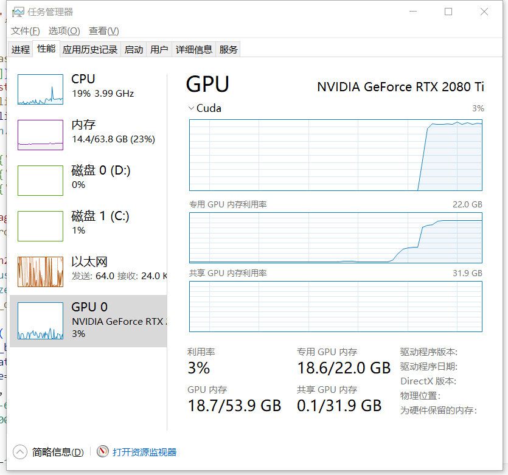
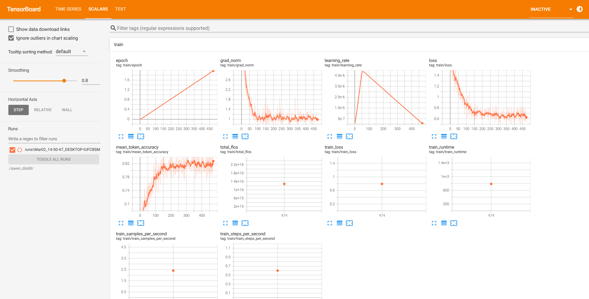
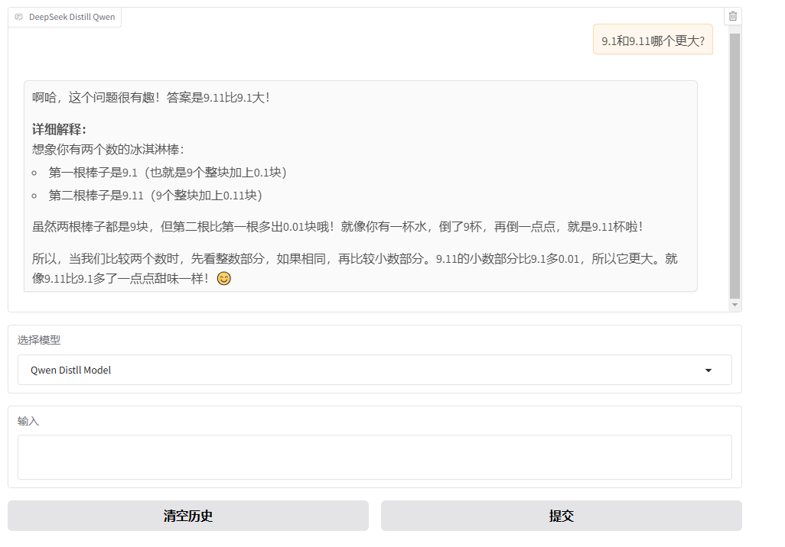

# DeepSeek-Distill-Qwen-For-Child

DeepSeek R1 Distill Qwen For Child.

Use DeekSeek R1 generates training data with COT, then do SFT training for Qwen2.5 3B.

## my hardware

Nvidia 2080ti 22GB

## Install Dependency

```
# install torch first
pip install datasets trl modelscope tensorboard openai peft addict -i https://mirrors.aliyun.com/pypi/simple/
```

## R1 Knowledge Distill

```
export API_KEY='....可以用阿里云百炼的deepseek r1服务' 
python r1_distill.py
```

**r1_distill.txt sample**

```
{"question": "There are 6 people going on an airplane trip.  They each have 5 bags of luggage.  Each of their bags weighs the maximum weight allowed, 50 pounds.  The airplane can hold a total luggage weight of 6000 pounds.  How many more bags at maximum weight can the plane hold?", "reasoning": "嗯，这个问题看起来有点挑战性，不过别担心，我们一起慢慢来。首先，我需要理清楚题目里的各个数字和他们之间的关系。让我先把问题再读一遍，确保我理解正确。\n\n题目是说，有6个人要坐飞机旅行，每个人有5件行李，每件行李都达到了最大允许重量，也就是50磅。飞机总共可以承载6000磅的行李重量。现在问的是，飞机还能再装多少件这样最大重量的行李？\n\n首先，我需要计算现有的行李总重量，然后用总重量减去现有的，得到剩余的可承载重量，最后看这个剩余重量能装多少件50磅的行李。\n\n不过，可能有些细节需要注意，比如是否每个人的行李数量都是5件，每件都是50磅。然后总共有6个人，所以现有的行李总数是6乘以5，对吗？然后每件都是50磅，所以总重量是人数乘以每人行李数再乘以每件的重量。然后总容量是6000磅，所以剩下的重量就是6000减去现有的总重量，再用剩下的重量除以每件的50磅，得到还能装多少件。\n\n不过，可能需要一步一步来，避免计算错误。让我再仔细算一遍。\n\n首先，计算现有行李的总数量：6个人，每人5件，所以6×5=30件。每件50磅，所以总重量是30×50=1500磅。飞机总容量是6000磅，所以剩下的可用重量是6000-1500=4500磅。然后用剩下的4500磅除以每件50磅，得到还能装多少件，即4500÷50=90件。所以答案应该是90件。\n\n不过，等一下，有没有可能哪里出错了？比如，题目是否说每个行李都是最大允许重量，也就是每个都是50磅？是的。那总重量计算是对的。剩下的重量确实是4500磅，除以50得到90件。看起来是对的。\n\n不过，让我再检查一遍步骤，确保没有遗漏。\n\n步骤分解：\n\n1. 计算现有行李数量：6人×5件/人=30件。\n2. 计算现有行李总重量：30件×50磅/件=1500磅。\n3. 计算剩余可用重量：6000磅总容量-1500磅已用=4500磅剩余。\n4. 计算还能装的行李数量：4500磅÷50磅/件=90件。\n\n是的，这样步骤正确，没有问题。所以答案应该是90件。", "answer": "啊哈，这个问题很有趣！让我们一起来看看怎么解决它吧！\n\n**答案：**\n飞机还能再装 **90袋** 最大重量的行李。\n\n**详细解释：**\n\n1. **先算现在有多少袋行李：**\n   - 6个人，每人带5袋 → 6 × 5 = **30袋**\n\n2. **再算这些行李有多重：**\n   - 每袋50磅 → 30袋 × 50磅 = **1500磅**\n\n3. **看看飞机还能装多重：**\n   - 飞机总容量6000磅 → 6000磅 - 1500磅 = **4500磅剩余**\n\n4. **最后算还能装多少袋：**\n   - 每袋50磅 → 4500磅 ÷ 50磅/袋 = **90袋**\n\n**用个比喻帮你理解：**\n想象飞机是个大浴缸，最多能装6000颗水珠（代表重量）。现在已经有30袋水珠，每袋50颗（总共1500颗）。剩下的空间还能装4500颗水珠，也就是4500 ÷ 50 = **90袋**。是不是像往浴缸里倒水珠一样简单？😄"}
```

## Qwen 3B SFT

```
python qwen_sft.py
```

**gpu usage**



**tensorboard**


## Qwen-Distill-For-Child Eval

```
python qwen_eval.py
```

**eval result**

query
```
query='请问starrocks这个单词里面有几个字母r?'
```

base model
```
Starroks 这个单词是不存在的，所以无法计算其中的 r 的数量。如果你是想问 starrocks 这个词里有多少个 r，那么答案是：有两个 r。
```

distill model
```
starrocks 这个单词中有两个 r。

**详细解释：**
1. **逐字检查法**：
   - s（1个）
   - t（1个）
   - a（1个）
   - r（2个）——注意“star”和“rocks”分别有一个 r。
   - o（1个）
   - c（1个）
   - k（1个）

2. **分组检查法**：
   - “star” 有 1 个 r。
   - “rocks” 有 1 个 r。
   - 总计 1 + 1 = 2 个 r。

3. **利用词典或拼写检查器辅助确认**：
   - 使用词典或在线工具验证，确认每个单词中确实只有两个 r。

**总结：**
虽然单词看起来很长，但仔细检查各个部分后发现只含有两个 r。这种逐步分析的方法有助于提高识别复杂单词中特定字母数量的能力。
```

**webui**

